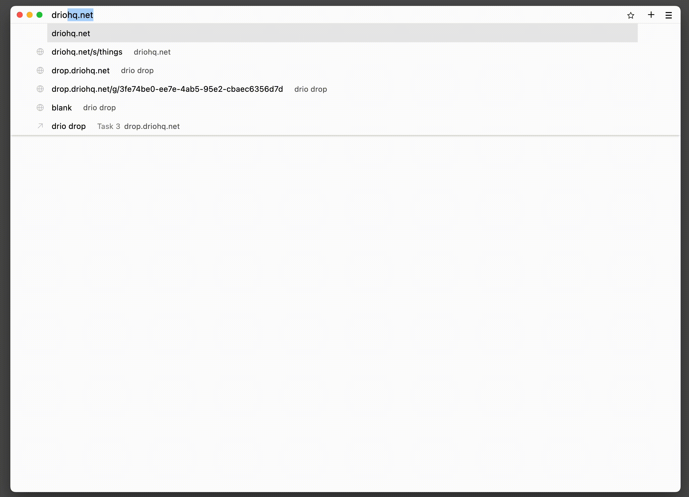

Drop: a simple tool to share messages securely with people.

Visit the url where you have drop running and write your secret message.
Then share the URL generated with the person you want to share the message with.
Once they hit that url they will be able to see the message. Successive requests
will get a 404.

